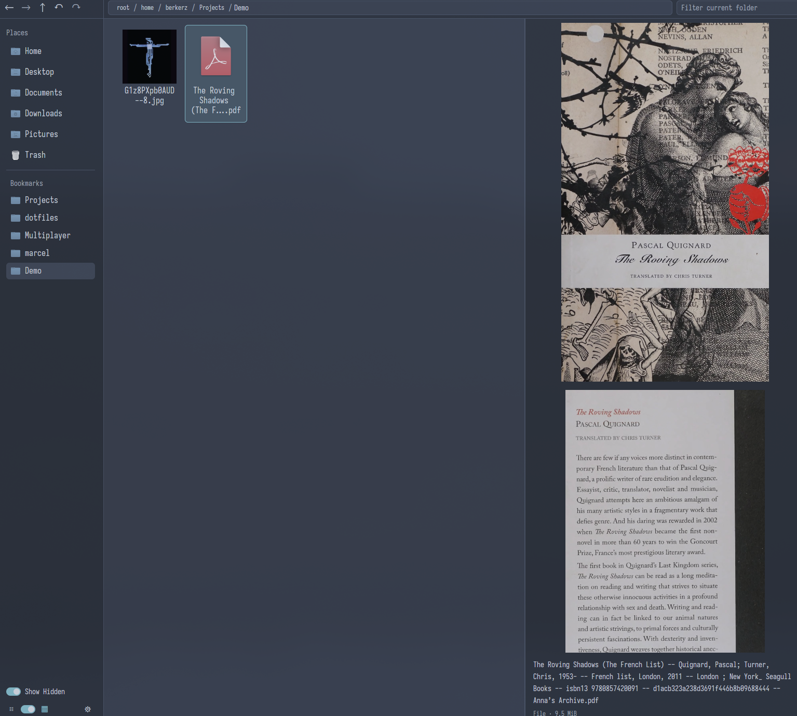

# Marcel

A fast graphical file manager for Linux, written in Rust. The preview pane stays open and useful as you browse, and file operations are careful about touching your files. Marcel does not depend on GTK or Qt.

Marcel renders its interface with [GPUI](https://github.com/zed-industries/zed), the UI framework behind Zed. It does not pull in a desktop toolkit or inherit its theme and startup cost. Select a file and you see it straight away: text, images, PDFs, or the contents of a folder.

Marcel borrows heavily from [Yazi](https://github.com/sxyazi/yazi). The filesystem layer, incremental directory updates, preview scheduling, and copy semantics all grew from reading Yazi's source. Marcel is a graphical application rather than a terminal one, so the interface is its own, but much of the machinery underneath owes Yazi a lot. [`THIRD_PARTY_NOTICES.md`](THIRD_PARTY_NOTICES.md) records what was adapted, file by file, down to the upstream commit.

## Status

Alpha. I use Marcel as my daily file manager, and it has been through two rounds of external review focused on filesystem safety. It has not been used widely by anyone else yet.

Copy, move, rename, Trash, restore, archive creation, and extraction can all be undone. Marcel checks that files are still what and where it thinks they are before touching them, and refuses rather than guessing. Permanent deletion is the exception.

Back up anything you would be upset to lose.

Linux only. Wayland is the tested target. X11 mostly works, but dragging files out of Marcel into other applications is not implemented there.



## What it does

### Browsing

Marcel has list and grid views, breadcrumbs, bookmarks, and the usual XDG places in a sidebar. Press `Ctrl+L` to type a path, or just start typing to filter the current folder with fuzzy matching. Selection works with a marquee or the keyboard. Folders update as they change on disk instead of reloading, and directories with 50,000 entries remain comfortable to browse.

### Preview

The preview pane handles text and code files, images, continuously scrolling PDFs, and folder listings. Thumbnails use the freedesktop cache, so Marcel shares them with other applications instead of generating another private copy.

### File operations

Copy and move operations show progress and can be cancelled. When a destination is taken, Marcel asks whether to replace, rename, skip, or merge the two folders. One answer can apply to the rest of the operation. Undo and redo cover copy, move, duplicate, rename, Trash, restore, archive creation, and extraction. Permanent deletion requires confirmation and stays out of undo history. Marcel also creates folders, empty files, and zip archives, and extracts most common archive formats; an extraction that lands on an existing name asks the same replace, rename, skip, or merge question a copy does. Move To… asks for a folder in the same chooser other applications get from Marcel and moves the selection there.

Properties (`Ctrl+I`, or `Alt+Enter` if your hands know KDE) shows what an item is, where it lives, who owns it, and its permissions and timestamps. What its kind adds comes from the same code that draws the preview: an image reports its dimensions, a PDF its page count, a text file its line count, an archive how many entries it holds and how big they unpack. A folder is measured in the background while the dialog is open, and a multi-selection gets a summary.

### Desktop integration

On Wayland, files can be dragged to and from other applications. Marcel registers as a file manager over D-Bus, so "show in folder" from other applications works. It runs one process per session, but each `marcel-rs` invocation opens a new window instead of taking over one you were already using.

Marcel can also be the file dialog. Applications on a modern Linux desktop do not draw their own open and save dialogs; they ask xdg-desktop-portal for one, and the portal hands the job to whichever backend is configured. Marcel implements that backend, so with it enabled the dialog that opens from a browser, an editor, or a chat client is a Marcel window: the same browser, preview pane, bookmarks, and type-to-filter you use everywhere else, plus a bar along the bottom with the name field, the file-type filter the application asked for, Cancel, and the accept button. Filters match case-insensitively, so `*.jpg` finds `Photo.JPG`. If Marcel is not running when a dialog is requested, D-Bus starts it. How to turn it on is under Installing.

### Appearance

Marcel includes several themes and ships its own icons and font, so it still looks right on a bare system. Missing icons fall back to the system icon theme. An explicit icon theme setting overrides both.

## Keyboard shortcuts

| Key                                              | Action               |
| ------------------------------------------------ | -------------------- |
| Arrow keys                                       | Move selection       |
| Home / End                                       | First / last item    |
| Page Up / Page Down                              | Move a page          |
| Enter                                            | Open                 |
| Escape                                           | Clear selection      |
| Ctrl+Up                                          | Parent folder        |
| Ctrl+Left / Ctrl+Right                           | Back / forward       |
| Ctrl+L                                           | Edit the location    |
| Ctrl+F                                           | Focus the filter     |
| Any character                                    | Start filtering      |
| Shift with arrows, Home, End, Page Up, Page Down | Extend the selection |
| Ctrl+A                                           | Select all           |
| Ctrl+C / Ctrl+X / Ctrl+V                         | Copy / cut / paste   |
| Delete                                           | Move to Trash        |
| Shift+Delete                                     | Delete permanently   |
| Ctrl+Shift+N                                     | New folder           |
| Ctrl+D                                           | Duplicate            |
| F2                                               | Rename               |
| Ctrl+I or Alt+Enter                              | Properties           |
| Ctrl+Z / Ctrl+Y                                  | Undo / redo          |

## What it does not do

Known gaps, roughly in the order they are likely to be addressed:

* No search. You can filter the folder you are in, but there is no recursive search by name or content.
* Moving between filesystems is refused. Marcel will not quietly turn a move across drives into a copy followed by a delete. It says it cannot do it. Copying across drives works.
* No removable volumes, network shares, or remote locations. Local paths only.
* No media playback, and no thumbnails for video.
* Sorting is fixed, and preferences other than view mode and hidden files are not persisted.
* The window needs to be at least 900 pixels wide. Below that the panes are collectively wider than the window and the preview pane runs off the right edge, so Marcel asks the desktop not to shrink it that far. A tiling compositor can insist anyway.
* Keyboard and accessibility coverage is incomplete. Some things are reachable only with a pointer.
* RAR extraction needs a separate build. The default package ships only free components.
* No Flatpak. Nix is the only packaging route today.

Not planned: tabs, as I do not like them very much.

## Installing

Marcel ships as a Nix flake.

Run it without installing anything:

```sh
nix run github:berker-z/marcel -- ~/Downloads
```

For a persistent installation, add Marcel as a flake input and import its
Home Manager module:

```nix
{
  inputs.marcel.url = "github:berker-z/marcel";
}
```

```nix
{
  imports = [inputs.marcel.homeManagerModules.default];

  programs.marcel = {
    enable = true;
    defaultDirectoryHandler = true;
    fileManager1 = true;
    fileChooserPortal = true;
    settings.theme = "nord";
  };
}
```

Do not add `inputs.nixpkgs.follows` to the input. Marcel pins its own
nixpkgs, and the binary cache holds builds against that pin; following your
nixpkgs produces a different derivation that has to be compiled locally.

`enable` alone installs Marcel and changes nothing else about the desktop.
The three flags are the integration you actually want from a file manager,
and each is off by default because it takes something over:

- `defaultDirectoryHandler` makes Marcel the `inode/directory` handler, so
  `xdg-open` on a folder opens Marcel.
- `fileManager1` makes Marcel answer `org.freedesktop.FileManager1` on the
  session bus, which is the D-Bus call behind "show in folder" in browsers
  and most other applications. Every launch of the installed binary then
  claims the name, and the module writes an activation file to
  `~/.local/share/dbus-1/services`. D-Bus reads that directory before any
  installed package's, so Marcel wins even with Nautilus or Dolphin
  installed; both ship a file claiming the same name.
- `fileChooserPortal` makes Marcel the open-file and save-file dialog of
  every application that asks xdg-desktop-portal for one, which on Wayland is
  most of them. It adds the portal variant to `xdg.portal.extraPortals` and
  names `marcel` for the FileChooser interface in `xdg.portal.config`;
  `xdg.portal.enable` is still yours to set (the Home Manager Hyprland module
  turns it on for you). After the rebuild, run
  `systemctl --user restart xdg-desktop-portal`: the frontend reads
  `portals.conf` once at startup, and until it restarts you keep getting the
  old dialog. Chromium-based browsers pick it up straight away. Firefox and
  Zen only use the portal picker when
  `widget.use-xdg-desktop-portal.file-picker` is `1` in `about:config`.
  Details in [`docs/file-chooser-portal.md`](docs/file-chooser-portal.md).

There is a NixOS module with the same options
(`inputs.marcel.nixosModules.default`; packages land in
`environment.systemPackages`). It has nowhere per-user to put the D-Bus
override, so with a second file manager on the system, which one D-Bus starts
for `FileManager1` falls back to profile order. Use the Home Manager module
when that matters.

The command is `marcel-rs`, not `marcel`. nixpkgs already has a `marcel`, an unrelated Python shell, and two packages installing the same `bin/marcel` collide in a profile. Only the command carries the suffix: the application is still Marcel everywhere you see it, including its icon, its desktop entry, its D-Bus name, and its config directory at `~/.config/marcel`.

Without the module, `overlays.default` provides `pkgs.marcel-rs`,
`packages.<system>.file-manager1-service` is the variant that claims the
`FileManager1` name, and `packages.<system>.file-chooser-portal` is the one
that answers file dialogs (it goes in `xdg.portal.extraPortals`, with
`xdg.portal.config.common."org.freedesktop.impl.portal.FileChooser" = ["marcel"]`).
Installing any of them changes no MIME associations; the details are in
[`docs/release.md`](docs/release.md).

## Declarative settings

`settings` covers theme, icon theme, and font:

```nix
programs.marcel.settings = {
  theme = "tokyo-night";
  icon_theme = null;
  ui_font = null;
};
```

Leaving `icon_theme` and `ui_font` as `null` keeps Marcel's bundled icons and font, which is the default.

View mode and hidden file visibility are deliberately not Nix options. Marcel treats them as interaction state and remembers what you last chose in `$XDG_CONFIG_HOME/marcel/state.conf`.

## Building

```sh
nix develop
cargo run
```

The development shell is required. A plain shell will not find the system libraries the build needs.

Use this repository's `nix develop` consistently for Marcel, including checks
and tests. A general Rust shell or system `cargo` can select another compiler
and invalidate the compiled dependencies in `target/`. The shell pins its
compiler through `flake.lock` and defaults to two Cargo build jobs. Avoid
`cargo clean` during routine development: it deletes those compiled dependencies.

`cargo run` reuses local development artifacts. `nix build .#marcel-rs` builds
the isolated release package; it cannot reuse `target/`. The flake uses Crane
to compile dependencies separately and reuse them after application-only
edits. Both routes select the same pinned compiler. Changes to dependencies,
the compiler, native libraries or build flags still invalidate the relevant
artifacts. The standalone nixpkgs recipe retains `buildRustPackage`.

To retain the release dependencies locally across Nix garbage collection:

```sh
nix build --accept-flake-config --max-jobs 1 --cores 2 .#marcel-deps --out-link .marcel-deps
nix build --accept-flake-config --max-jobs 1 --cores 2 .#marcel-rs
```

Keep the `.marcel-deps` symlink while developing. The first build with this
recipe compiles the dependency set once unless Cachix already has it. Release
CI publishes the compiled dependencies as well as the finished application;
these artifacts use more cache storage than the runtime binary alone.

Cachix serves complete Nix builds with matching inputs. System configurations
should consume `packages.<system>.marcel-rs` from this flake, retaining its
own locked nixpkgs, to match the published cache. Applying the overlay against
another nixpkgs revision can produce a different build. The cache workflow
runs on every push to `master` as well as on release tags, so a commit is
cached a few minutes after it lands; pinning a revision before its workflow
has finished still means a local build. Development-shell and release builds have
different profiles and do not share compiled Cargo artifacts.

## Credits

Built with [GPUI](https://github.com/zed-industries/zed) (Apache-2.0) and [gpui-component](https://github.com/longbridge/gpui-component). PDF rendering goes through Poppler, archives through 7-Zip. Icons are a small subset of [Nordzy](https://github.com/alvatip/Nordzy-icon) (GPL-3.0) and the bundled font is a subset of [Iosevka](https://github.com/be5invis/Iosevka) (SIL OFL).

And Yazi, again, for most of the thinking underneath.

## License

MIT, see [`LICENSE`](LICENSE).

Bundled assets keep their own licenses, which are not MIT. The icon set is GPL-3.0 and the font is under the SIL Open Font License. Full details, along with the record of adapted code, are in [`THIRD_PARTY_NOTICES.md`](THIRD_PARTY_NOTICES.md).
